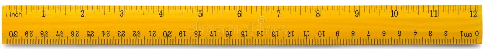

## A Ruler is for Making Straight Lines

---

Patterns are everywhere in life. Using models and templates to make copies and designs but why? Well, it’s because structure helps keep things together, organized and gives a jumping-off point to get started with. For instance, teachers use patterns to make a schedule, so while they may change something’s they can stay consistent with what they have to accomplish. Another example of this is a ruler, as basic as it might be, a ruler can be wooden or plastic. But they’re consistently able to make straight lines by following the pattern of a basic ruler.

Knowing that patterns are everywhere in life, design patterns in computer science, in general, are a repeatable solution to a recurring problem in software design. While this doesn’t mean it’s a finished solution right away, just like the ruler it gives more consistency to then grow from. Making finding the right solution much easier, quicker, and with fewer issues.

## Design Patterns

---

Recently I have been working with various types of design patterns. When initially learning Javascript, I used the Prototype pattern which created a copy of a prototype object. We also worked in Meteor using the Observer pattern, which was used to notify a list of dependents about certain changes. These were just a few examples of design patterns I have been able to work with recently. Some others include Model-View-Controller, Front Controller, Singleton, and Factory.

Design patterns are a template for how to solve a problem that can be used in many different situations. Knowing the basics of how to use design patterns can benefit anyone interested in software engineering. This is why I would recommend learning how to use these patterns to better your work.

## Final Thoughts

---

Finally, learning about design patterns and having consistency to follow has improved my ability in web design immensely. Consistent work is important when developing anything, so I think design patterns are a great way to improve anyone’s web application. For me, it’s much easier creating sites knowing that I’m not starting from scratch, and it allows me to get better results in a much faster and consistent way. So, while a ruler is for making straight lines, you can use design patterns for improving your web designs.

