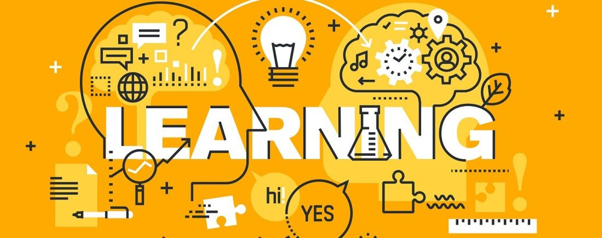

  
  

  all image credit to: https://elearningindustry.com/how-design-thinking-transforming-learning-experience-free-ebook

## Lifelong Learning

To this day I believe that in life you will always to continue to grow and learn. I have always done this previously, through my creative outlets. Whether it be in high school where I took every possible extracurricular class, like drawing, painting, auto body, auto paint, metal work, glass, etc. As I got closer and closer to graduating however, I still wasn’t sure what I wanted to pursue as a career. Then I found the vast field of software engineering, and with it I decided that I wanted to attain a job in Video Game/Software Development. This way I could possibly implement my creative itch, while also continuing to grow and learn. I have always enjoyed playing video games, but I never really thought it would be possible for me to be apart of making them. Now, I’m learning more and more with every class and hope to continue this trend moving forward. 

## Developing for the Future

Looking toward the future, I have a lot that I need to continue working on. While I now have almost two years under my belt, I still find it difficult sometimes to grasp certain topics and I overall just want to improve my programming ability and competency. I enjoy collaborating with others to further my understanding on topics, and as I continue, I hope to find even more people willing to work with me. I would also like to find an internship or job related to software development, so that I can gain real world experience and skills to succeed. 

## Conclusion

Finally, I'm just excited to see what the future has in store. I'm hoping that with each class and project I take, I'm continuing to learn and grow so that I can be successful in the end. Further learning how to implement my artistic abilities into programming and just growing along the way. 
