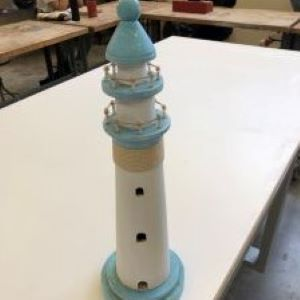
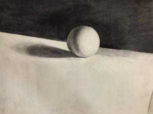
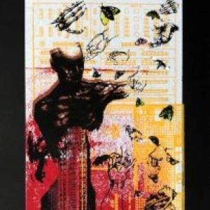
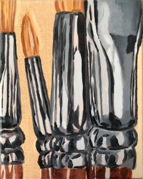

  
  
  
  
  

## Description

In this above photo I'm showing a project I took on during the fall semester of 2020. I decided that I wanted to repurpose an ld wooden lighthouse my grandmother had given me. So with the help of the woodworking department at the University of Hawaii at Manoa, I was able to learn many different techniques in the process of woodworking. But this is just one art project that I wanted to do in the past. More recently I have taken many other courses such as screenprinting, drawing, and now painting(see some of my work above).

## Why Art?

While these may seem unrelated to my other major in Computer Science, I think that everything that I do are all related. Both of these classes require a sense of creativity and problem solving, so whether I'm learning to use new tools or software, I'm working on new ideas and ways of thinking. It can also be compared due to the time crunches, because most of my art classes work on a schedule too, I learn more about time management and project management so that I know I can finish a project on time. Overall, I definitely think that working creatively outside of class will benefit me into being a better problem solver and craftsman in everything I do. 

