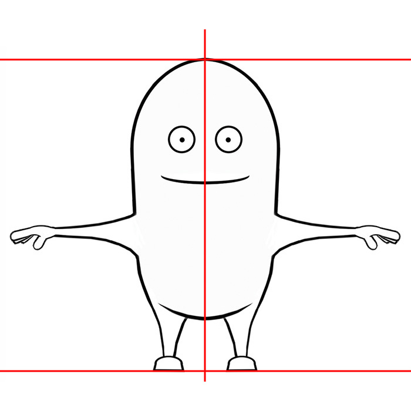
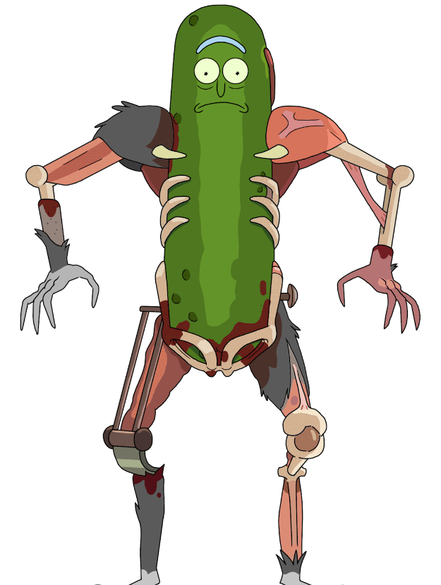
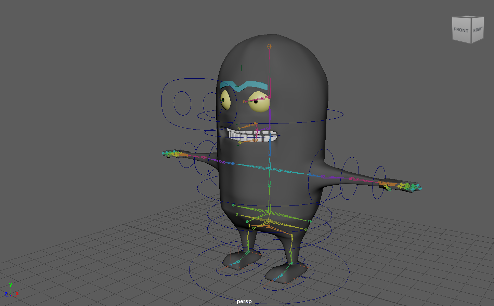
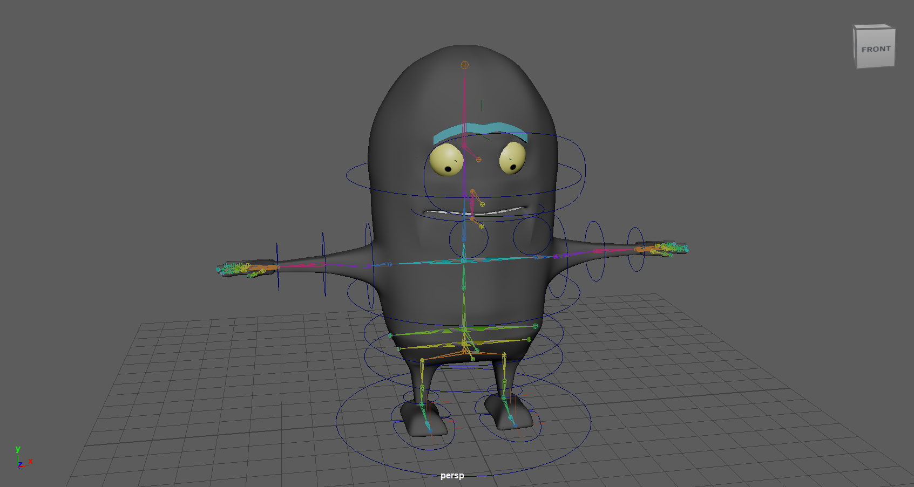
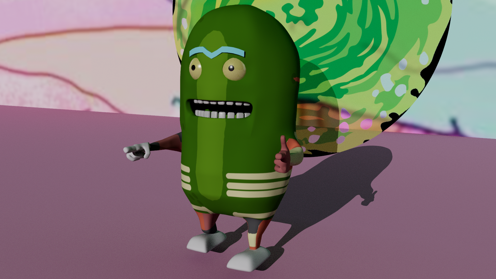

## Making the Character

---

From the time I first attempted to model a 3D character, I’ve always wanted to dive deeper into the topic. Here I was able to do just that, working on my skills to use a reference image and shape a figure in 3D software. Before this, I had only really created characters and objects building off of basic shapes, but with this project, I worked to use more of the points, faces, and edges to change the shape I originally had.

Once I finished extruding and shaping the overall shape of the character, I moved on to UV texturing. Here I improved upon my previous environment project's textures by creating my UV map. Cutting the faces so each body part is separated and exporting that texture map to be painting in Procreate. The character I decided to make was Pickle Rick from the show Rick and Morty. I chose him because the Minion shape similarly matches his pickle shape, and I thought the UV mapping would be interesting and different.

## Rigging & Posing

---

After I had completed the body and textures of the character, I moved on to rigging his body starting with the main hips. Each joint I created correlated to various parts of the body, and we then used hierarchies to accurately move my character. When the joints were all working, I moved on to painting body weights, fixing any awkward movement found in the body. Then, using blendshapes I duplicated the character's mesh and created different facial expressions using the eyebrows, mouth, and eyes so that my original character could easily be modeled. Following the rigging, I now had a fully functioning character who could be easily controlled through both the joints and NURBS curve controllers.

Another new topic we covered for this project was character posing. Before starting the project we used premade character rigs to pose certain emotions, so after finishing the character rig I referenced images of Pickle Rick to pose him interestingly.

## Experience

---

Topics Covered in Project:
 - Model Sketches of Character(side, front, top)
 - Blocking in Model
 - UV Texturing
 - Body Rigging
 - Painting Body Weights
 - Facial Rigging/Blendshapes
 - Posing/Emotion

Overall, I found this to be a rewarding experience creating this character from basic shape modeling to a finalized rig. Learning all of the basic steps to begin a character shape from a reference, and developing unique shapes were both things that I learned a lot more about. As well as creating a proper body rig with joints more similar to that of a human body. I feel that the more that I continue to develop these skills, I will only continue to improve my skills concerning modeling, rigging, and texturing.

To view my in progress work, references, and final files click [here](https://drive.google.com/drive/folders/1KHLnrIM9wZR2xj7eNJ7Esqlpf54d5y0b?usp=sharing)

