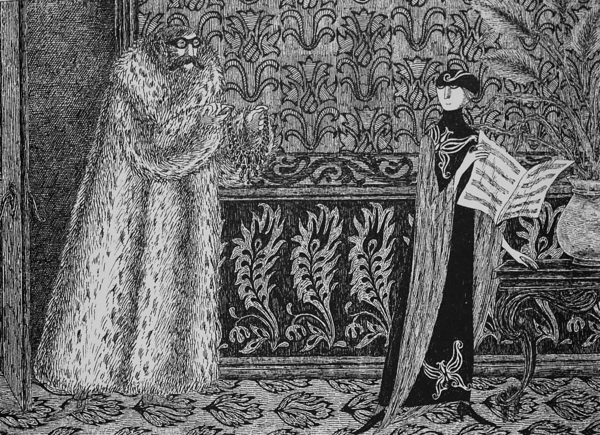
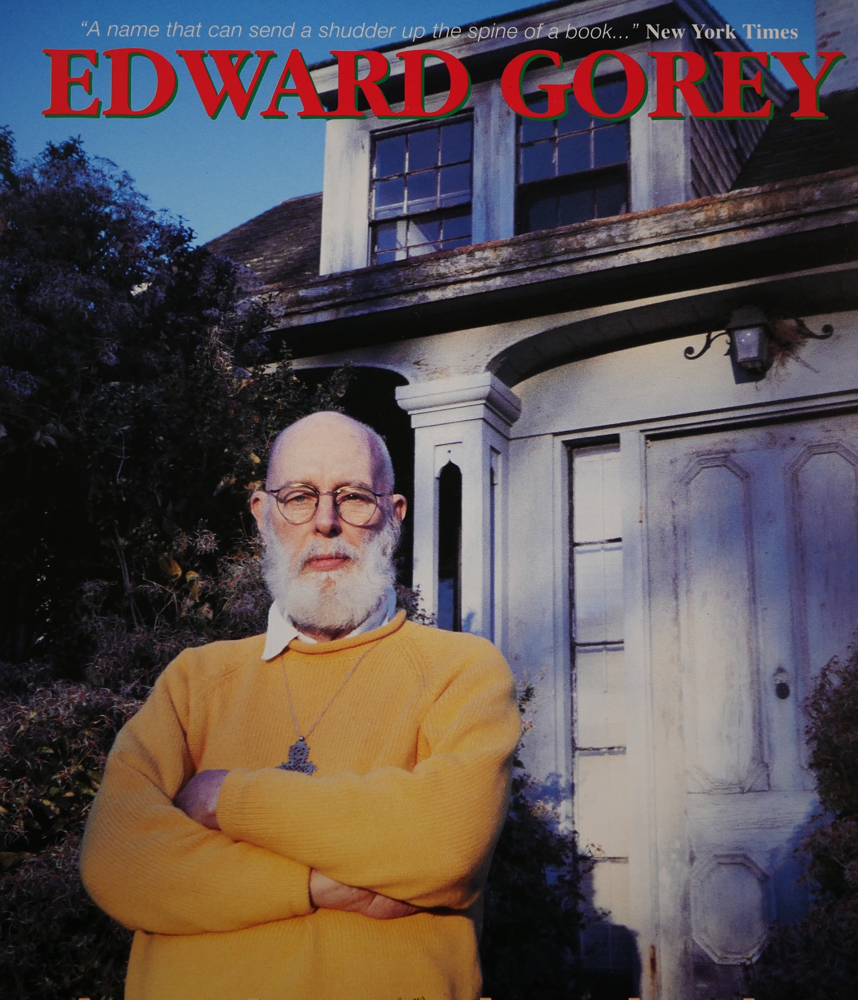
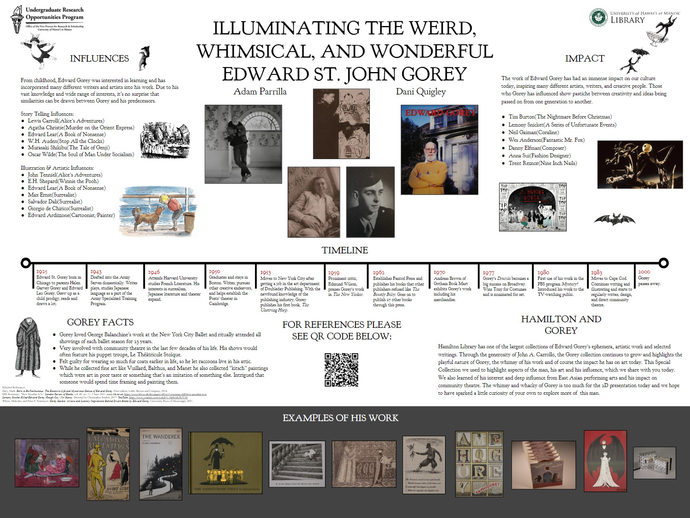
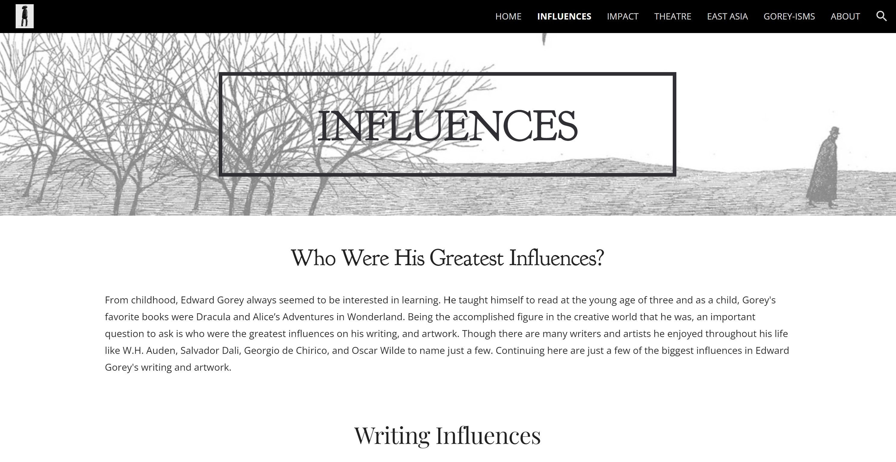
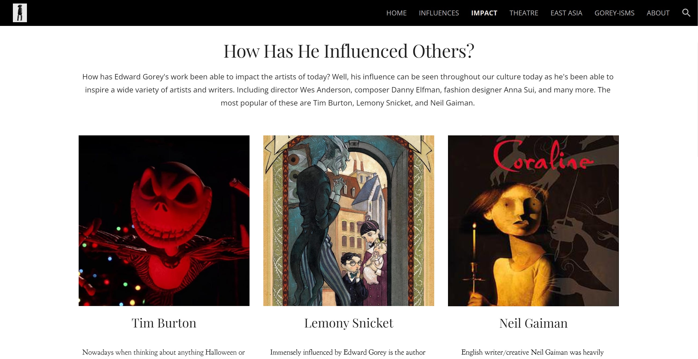

## Who is Edward Gorey?

---

Edward St. John Gorey was a writer and artist known for his pen & ink illustrations and unsettling narratives. He is a Tony award winner for his work on the 1977 production of Dracula and was able to produce a wide range of work from book covers, to short animations, and even handmade dolls. People were drawn to him for his quirky style, and those who know about him can never forget his impact on the writing and artistry of today.

## Our Projects

---

I worked alongside Dani Quigley and was supervised by Jean Thoulag and Sarah Nakashima. Both Dani and I worked to create a research paper on Edward Gorey based on a topic of our choice. We also worked on a poster that we shared at the University of Hawaii at Manoa SURE Symposium, as well as a website for which Hamilton Library will be sharing as a way to introduce others to Edward Gorey.

For my research paper, I decided upon delving into his influential impact, following those who've influenced his work and those whom he has impacted today. From childhood, Gorey was always interested in learning and incorporated many different writers and artists into his work such as Lewis Carroll(Alice's Adventures in Wonderland), Agatha Christie(Murder on the Orient Express), Edward Lear(A Book of Nonsense), and Max Ernst(Surrealist Artist) to name just a few. His work has also had an immense impact on our culture today, as he has inspired many different artists, writers, and creatives such as Tim Burton(The Nightmare Before Christmas), Lemony Snicket(A Series of Unfortunate Events), and Neil Gaiman(Coraline). In my paper I talk about how he took inspiration from every aspect of his life, learning from those before him and inspiring people after him to continue that same growth.

Though the research paper was for the most part individually done, I was also able to collaborate with Dani Quigley an Art History major to create a poster and website for this project. For the poster, we created a rough draft of where our information would be sectioned along with the topics we wanted to cover. In the end, we decided to implement her research on Gorey's involvement in plays and history to add to my research on his influences and impact. From this collaboration, we worked together to photograph images, create a timeline, and create a cohesive design for our poster.

For our website, we decided for ease of use to create it using a website builder, Google Sites. I have never used a website builder before, but through this experience, I have found that it can be used to create a product of which I'm proud. For this website, we again worked together on parts that were similar to the poster, but our pages followed more of our research papers to formulate certain pages.

## Experience

---

This project was a gratifying experience for me because I not only got to work with Edward Gorey's work but also gained experience in new forms like writing and posters. Collaborating on projects is always a highlight for me when working on any project. It's very enjoyable to begin the process with an idea, then plan and execute our ideas in a way that creates an even better product than could've been done with just one person. Overall, I have enjoyed this experience and I know that the skills I've gained from this will only continue to help me further my goals and dreams.

