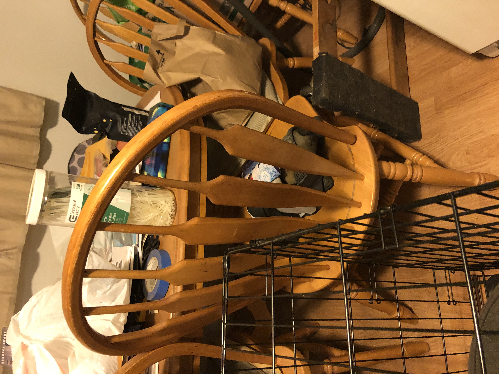
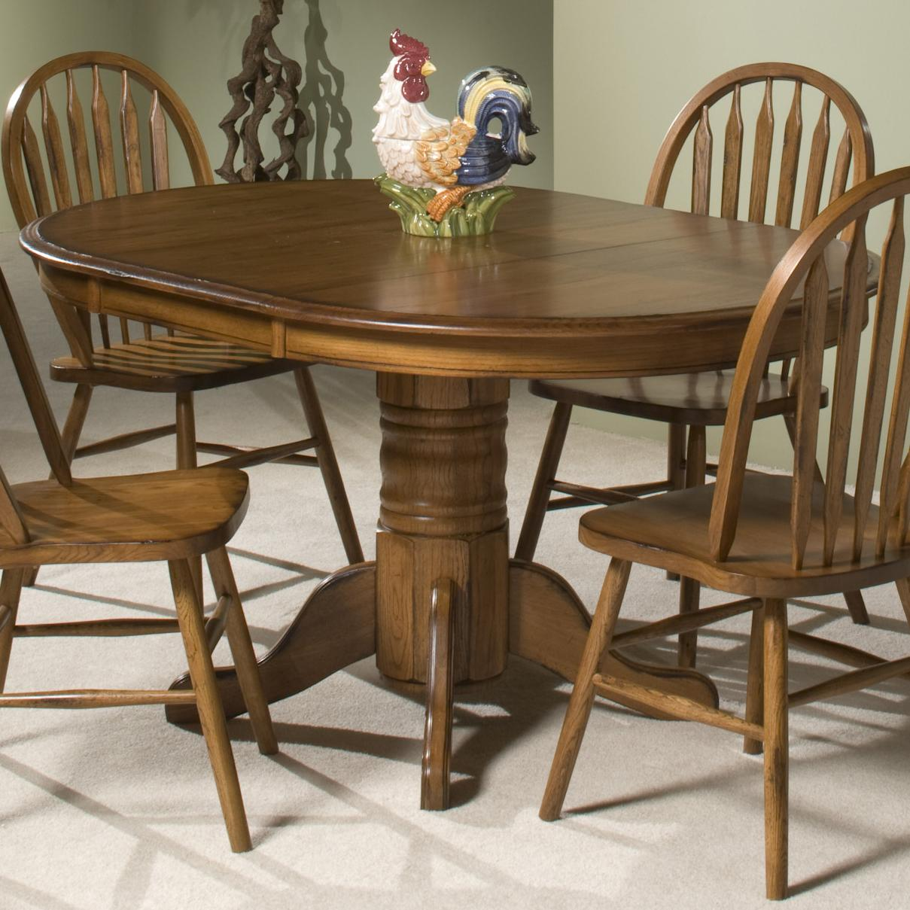
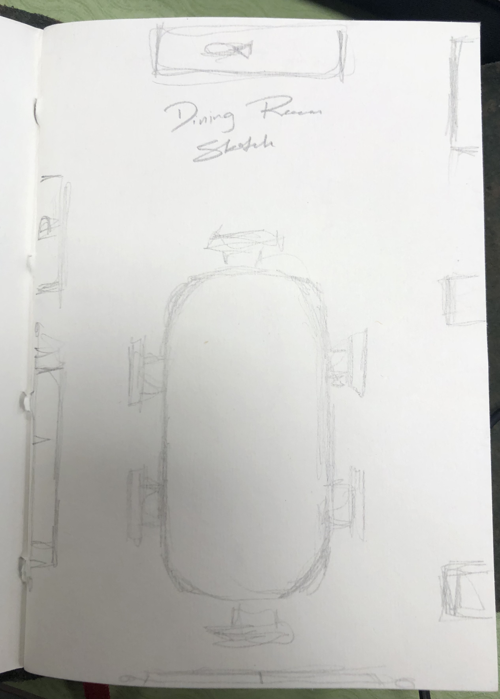
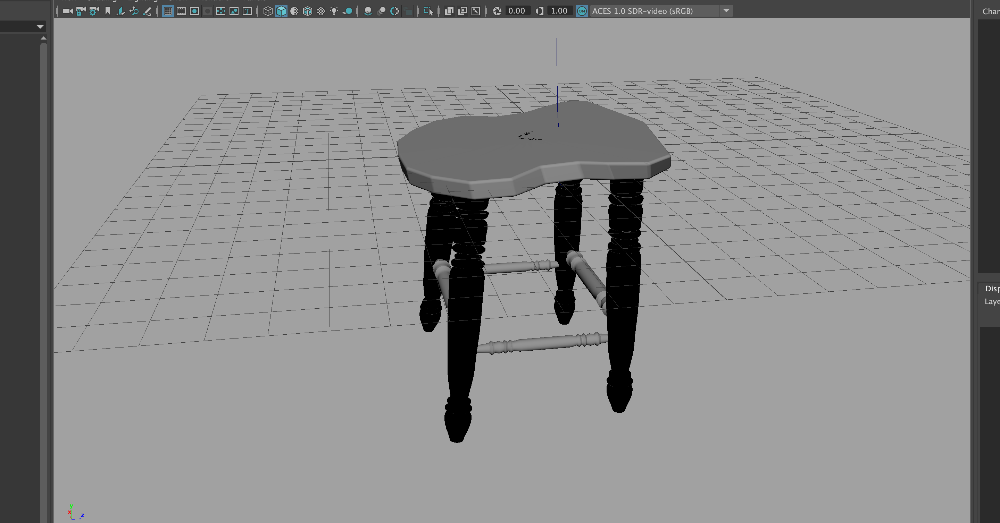
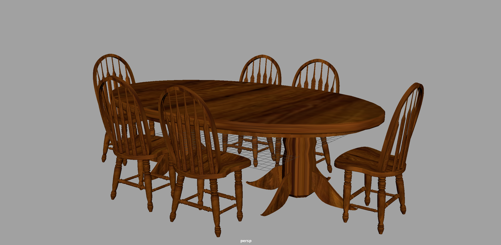
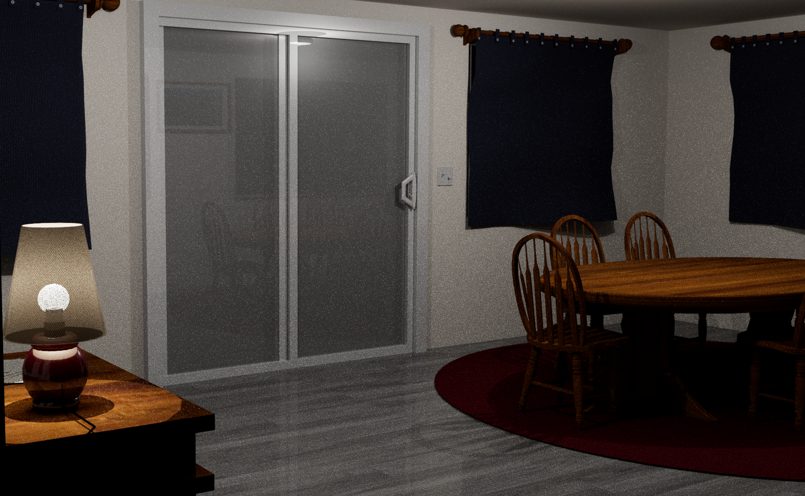
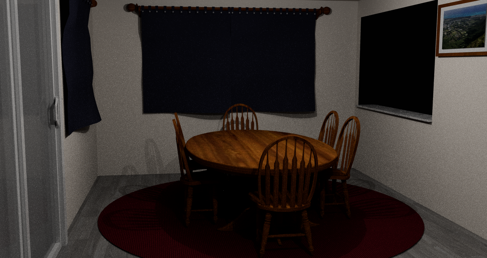

## Introduction to Maya

---

As one of the first projects I had the chance to work on in Maya, developing an environment was important in developing my skills using the software. There was a wide range of topics that I’ve learned from this process, such as:

 - Navigating the Maya interface
 - Working with polygon primitives
 - Groups & Hierarchies
 - Coloring objects
 - Animation with keyframing
 - UV textures
 - Camera movement & framing
 - Rendering sequence of images & converting to video
 - Developing a project
    - Sketches
    - Reference Images
    - Early models
    - Final scene

This was a great introduction to Maya also because I was able to experiment with the various ways you can model objects, such as scaling, move, rotate, revolve, extrude, and more. Having a strong base of references allowed me to utilize a variety of modeling methods to achieve the scene I wanted.

This introduction to Maya has allowed me to feel very comfortable with working on future projects, and I hope to continue learning about environment development and how it can be further improved upon.

## My 3D Environment

---

For this 3D Environment project I decided to recreate my homes dining area. For a little while it has been a mess around the dining area of my house, so I had wanted to recreate it as if it was fully remodeled. To do this, I wanted to keep the essential parts of the room that represent the room to me, so my main focus was on the layout, and the two wooden pieces of furniture, the dining table and computer desk.

To create the table I worked to replicate my reference image, attempting to recreate the rounded top of the table, and hard edge of the bottom. I utilized extruding to extend from the faces along the bottom of the table, creating the legs. As well as moving specific points along the bottom of the legs to make it curve outwards. Working on the chairs, and interesting tool I used was revolve, where I drew out the curves on the legs to add dimension to my chairs.

When I had worked on the computer desk, the tool I found to be most interesting was boolean. Using this, I would duplicate the part of the desk that was to be hollowed out and scale it down before using boolean to remove that area from the shape I want to have. I also made use of the ability to reduce a polygons number of sides and the rotate ability to create the silvery handles which are specific to the desk.

Some other highlights of this project:
 - Screen door & door handle details
 - Light switches on the wall
 - Curtain rods & holders
 - Buttons on the curtains
 - Computer desk lamp
 - Picture frames & mats

## Experience

---

Looking back on this project I feel like I’ve learned a lot. These building block skills in Maya have allowed me to thinking creatively about how I can make the environment I want, and now that I have first hand experience developing a project from an idea I can now move forward with confidence in my abilities in Maya.

Thinking towards the future, somethings that I think could be improved upon with this project could be the curtains. Here I had used the Maya cloth texture which worked just fine for the project, however given another chance to work on this project I would’ve liked to explore the nCloth tool. This allows you to create more realistic fabric, rather than one which I had pulled out point by point. I also think that I would add a table cloth and possibly other table accessories like plates, and cups. Finally I think this process could be better by learning more about the Arnold renderer that I used. Have I had everything perfect I would’ve liked to not have it look so grainy in the end render.

To see a short render of the project click [here](https://www.youtube.com/watch?v=YuJwgGYpdjs&ab_channel=AdamParrilla)

As well as my in progress work, references, and final files which can be found [here](https://drive.google.com/drive/folders/1xTvN2eA0__ZX8GMJ5ysaLJI8lIZUU3Jk?usp=share_link)