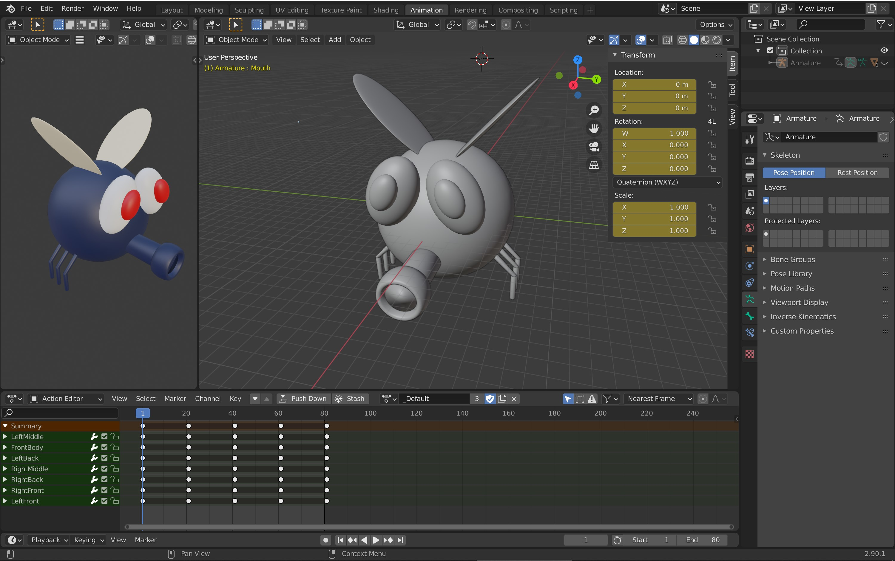
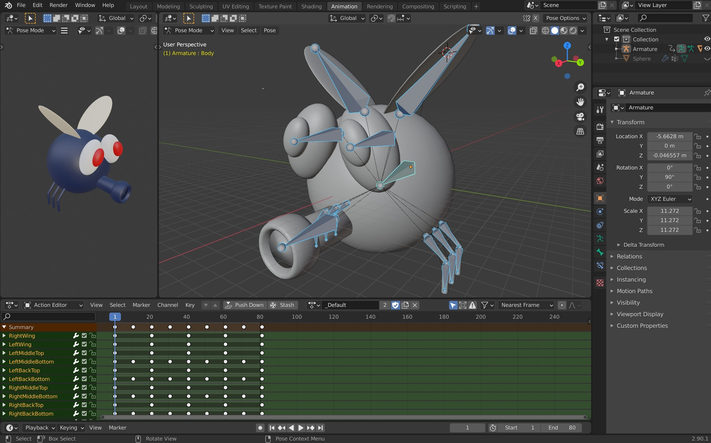
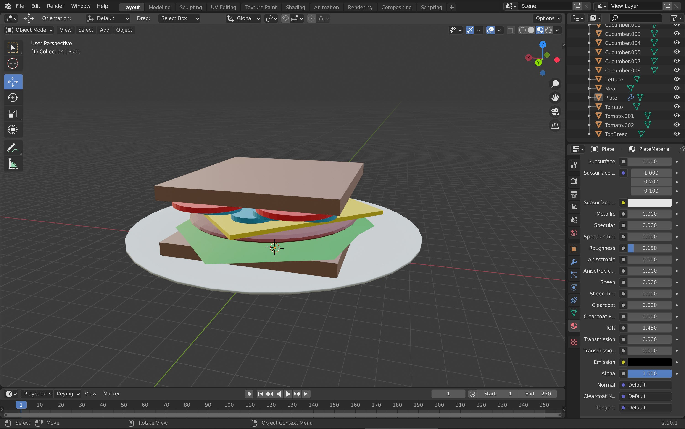
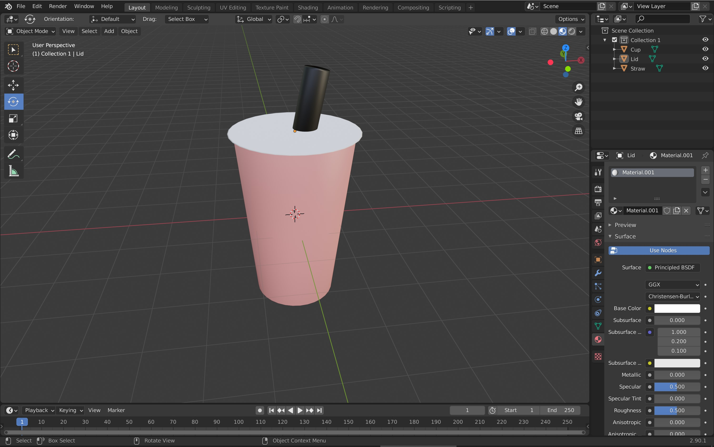
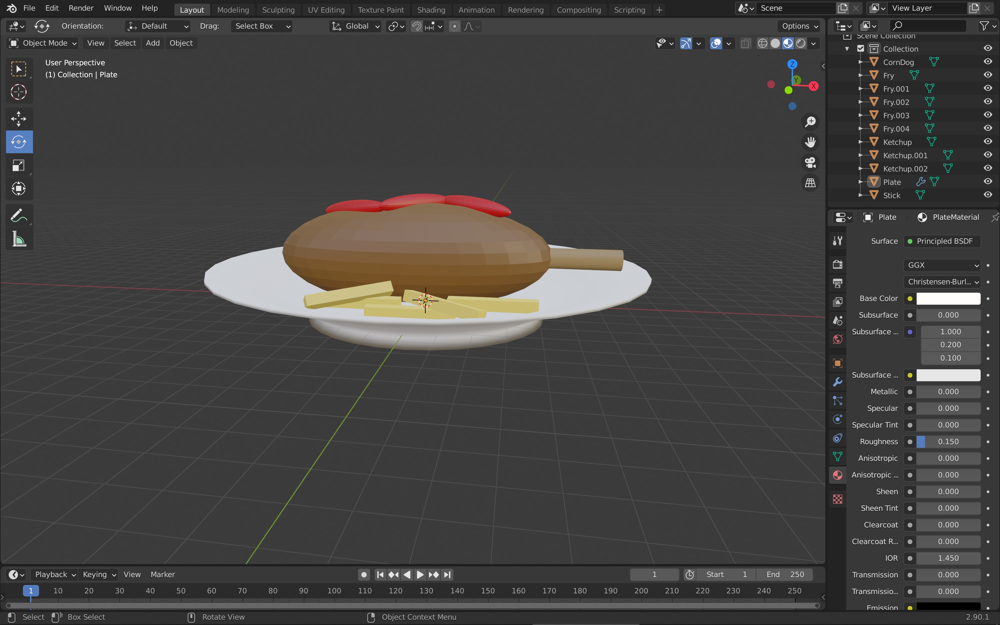

## Creating a Character

---

During the summer of 2021 I decided I wanted to learn how to incorporate my artwork into game development. I knew that I wanted to learn how to develop games in Unity, so after taking a few free courses and learning some basics I found out about Blender. [Blender](https://www.blender.org/) is a free 3D content creation program where I learned through experimenting and online tutorials how to create this character and items by using mirroring, basic 3D objects and modeling to name a few.

For the fly character, I had an idea of a game where you are trying to avoid swatters and make it across the dinner table and out the window. I began with a sketched design of what I wanted, then I moved into using various shapes like spheres and cylinders to model exactly what I wanted. I next colored the character before going onto the final step of learning how to animate its movements. This was tricky but through trial and error I was able to learn how to attach an armature to my character. Then using that armature to move the limbs and body of the fly, I created flying, jumping, and walking animations which can be used in the game in the future.

## Item Designs

---

These next few items I designed were in-game items from drinks, to plates of food for the player to walk on as they run across the table. To do this was very similar to making the fly, I had to use various 3D shapes, sculpting them to create the items I wanted. Before deciding what color I wanted to make each object so they would match my ideas. The items you can see below are a sandwich plate, a boba drink, and a plate of fries with a corndog. But these were just a few of the items I designed for this project.

## Experience

---

Finally, I really enjoyed the process of sketching an idea, planning and executing that in a 3D model and hope to be doing more of this during my free time. My goals for the future is to just continue to work on this game during my free time and eventually have it as a presentable project for the game design and development I'd like to do in the future. Overall, I think this was a great learning experience and challenged me to work out everything independently, and I am excited for what I can do with this knowledge moving forward.

