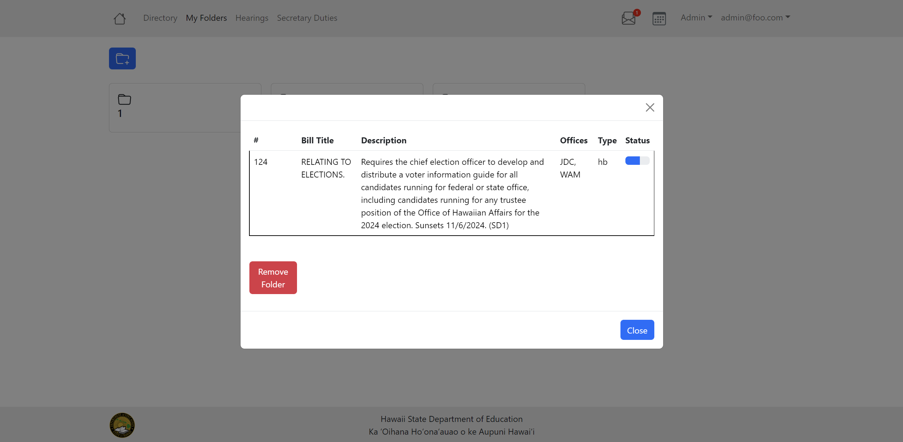
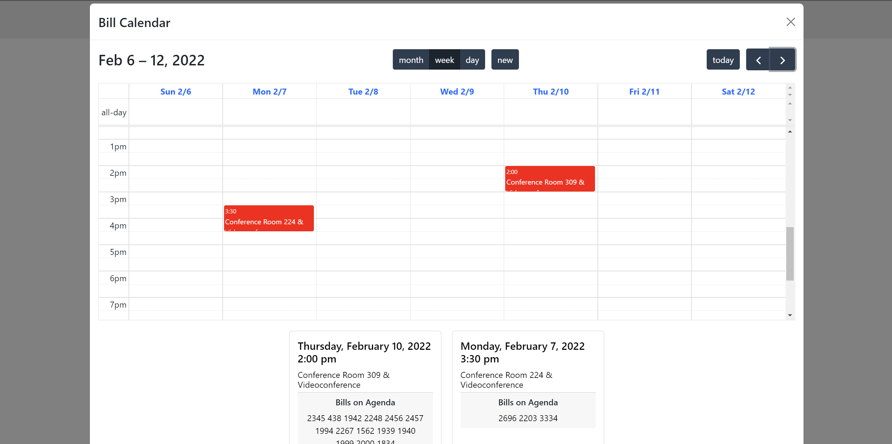

## The Problem

---

The Hawaiʻi Department of Education currently has an outdated legislative tracking system that has slow and inconvenient workflows, as well as a deprecated server. Because their system manager is retiring within the next five years and there will be no other member to provide support for the tracker. They want to upgrade, modernize, and replace their system before their current system manager retires.

## Our Solution

---

To resolve this, our group made a tracker that encompasses the required features they needed such as adding, removing, and storing bills, the ability to sort viewed bills by user preference, create testimonies, as well as new features such as a calendar system, personalized folder page, email notification system, and more. This new legislative tracking system will increase the clarity and legibility of the previous system by eliminating unnecessary clutter and allowing for easier navigation of the web page. Overall our goal is to enable them to track legislation and set up their workflow processes more efficiently and accurately than before.

## My Contributions

---

Thinking back on this project, my contributions included a wide variety of things, when we first started I designed the mockup pages for the profile and email pages. This led to me working on the profile page and rendering the information from our user database onto the site, as well as rendering the bill hearings on the Calendar. I also worked on the design of the MyFolers user interface, fixing it from basic text to a more visually appealing popover of information. After we had worked a lot on the functionality as a group we began working to finalize our product, where I then worked on fixing our directory MyBills filter to eliminate errors.

## Experience

---

Overall I found this project to be rewarding, our group worked very well together and utilized both GitHub and Discord for easy communication and time management. We would also meet twice a week in person together, and because we grouped our goals by milestones/projects we were constantly trying to create something new before we had to present it to our client. This project has given me a lot of experience in working with larger groups as we had a team of 8 people, which meant project management was vital in our group's success. In conclusion, this project has been amazing to be a part of and I look forward to future work experiences like this.

To check out our source code for this tracker click [here](https://github.com/hidoe-legistracker/hidoe-legistracker)

Our group’s project page can also be viewed [here](https://hidoe-legistracker.github.io/)