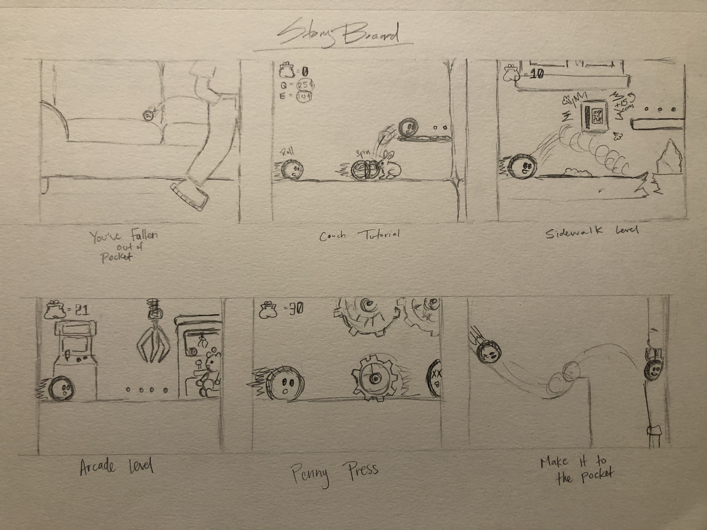
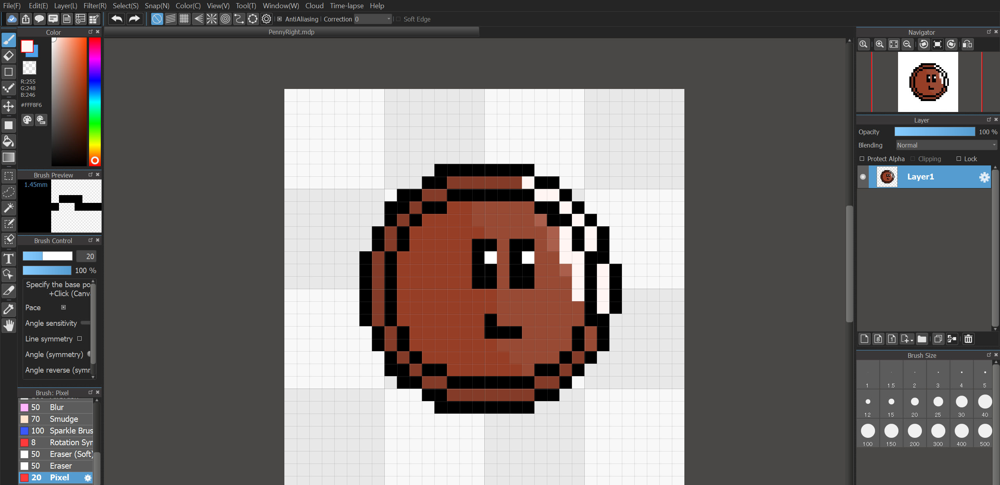
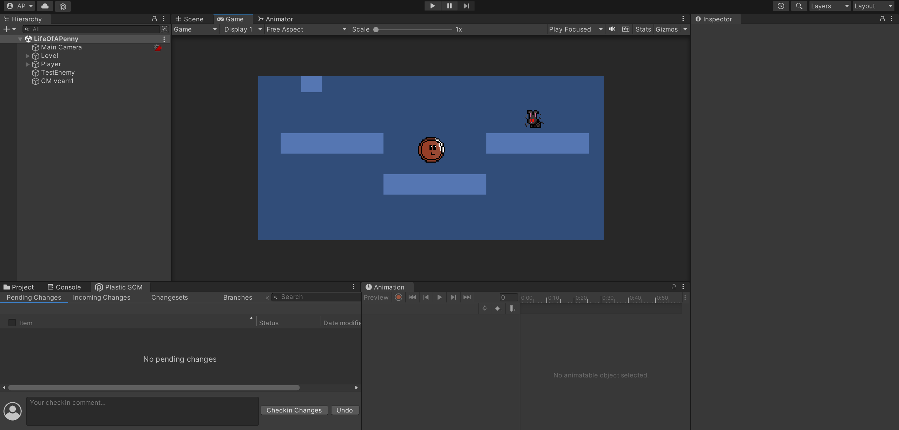

## Project Brainstorming

---

To begin we began brainstorming ideas individually, and met to share each of our ideas for the game we'd be creating this semester. In the end we went with one of my ideas where the game is a 2D platformer, where you roll through a variety of places playing as a penny trying to return to the pocket that dropped you.

After that I drew up a storyboard which we would use considering levels, enemies, and our overall look of the game. 

## Character Movement & Design

---

For my part of the project I began working on character designs, and animations for the movements. Following online videos, slides I received in class, and online documentation I also worked to create a smooth player movement system. Adding things like dash movements, as well as wall jumping to the basic movements of the penny character. 

## Enemy Designs & Collectibles

In my spare time I also began working on the basic design for the first level's enemies. This included a dust bunny, cotton ball which will later have an animation added to their idle positions of clouds surrounding their bodies. 

I have also designed some basic coins which will serve as our collectibles for the game. One being a smaller penny and another being a silver colored quarter, which when collected by the player will give them currency to purchase abilities such as extra size and power, or speed. 

## Plans Moving Forward

---

As I continue working on the project, me and my groupmates with continue to work on enemy movements, designs, and overall layout for each level just to name a few of our goals.
