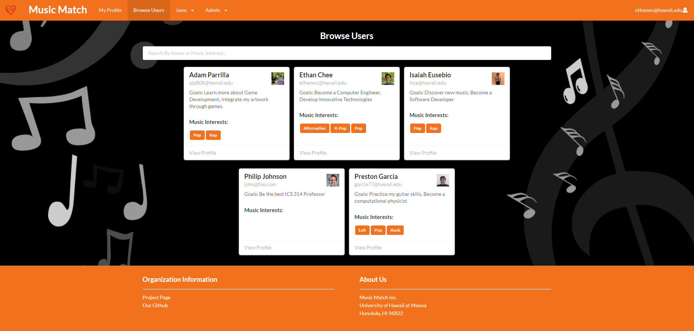

## Description

For my final project for ICS 314, I was able to work with Ethan Chee, Preston Garcia, and Isaiah Eusebio. We collaborated to produce Music Match, a web application that used all of the information we learned throughout the semester in Javascript, HTML/CSS, Semantic UI, Semantic UI React, and Meteor all in one project. Here, we designed a web application that allowed users to create their own profiles, showing their goals, instruments, skill level, and music interests. You can also browse other user’s profiles and build new connections with people you’re interested in. Another feature of the site is the ability to share jams, this gives users a place to post YouTube videos of their favorite music or their jams for others to see.

## My Contributions

My contributions to this project included developing the Browse Users, Admin, and Edit Jams pages front end to include the basic layout and style for those pages. This meant doing things like creating the format for the user cards and jam cards to show the style we were going for. I also created the About Us page that shows more information about our project, group members, and links to our LinkedIn and GitHub accounts. Another part that I worked on as well as developing tests using TestCafe for our Admin and Browse Users Pages, to test that they work properly. Finally, some other parts of the site I worked on included linking Jam Cards to a user’s profile, redirecting a user to the home page after creating an account, and with the help of Ethan Chee, make the featured jam on the Home page changeable by an admin user. After getting feedback from a user, one minor change I made was making the Login text in “Login to begin exploring” on the landing page a clickable link to take a user to the login page.

## Experience

Although this was my first time trying to fully develop a web application, it did teach me a lot about web development and teamwork. And even though I was a bit intimidated by this project at first, by the end I felt accomplished that the time spent learning throughout the semester greatly helped me to work well with my group. Through this project, I’ve gained a lot of great experience that will hopefully benefit me in the future. For instance, working with collections although confusing at first, after finally understanding has given me a much deeper understanding than would’ve else not gotten. Having accomplished completing this final project I do think I will have an easier time developing web applications in the future. All in all, this project gave me a much deeper understanding of all facets of web development and has greatly improved my skills as a software engineer, and I look forward to expanding on this with my future endeavors in web development.

To check out our source code for this website click [here](https://github.com/music-match/music-match)

Our group’s project page can also be viewed [here](https://music-match.github.io/)
