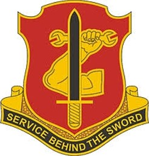
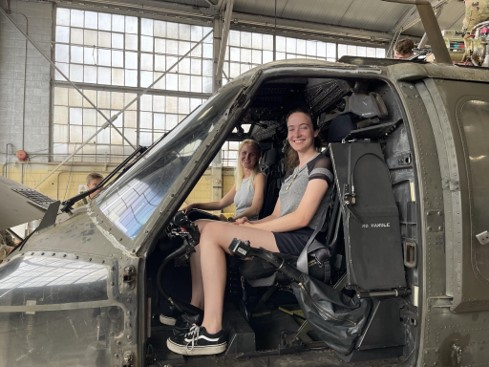
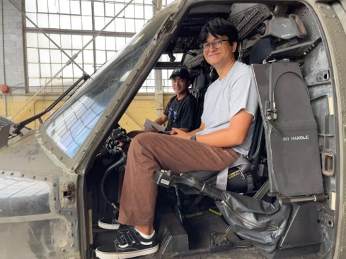
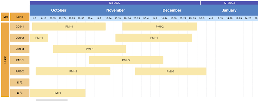
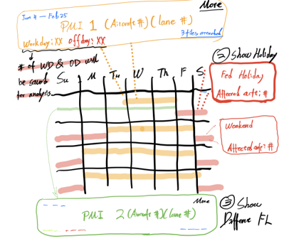
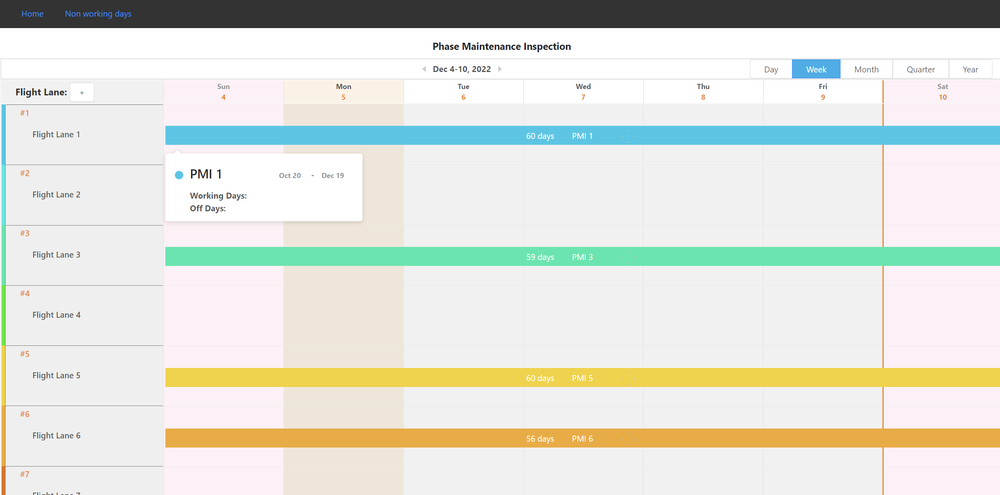
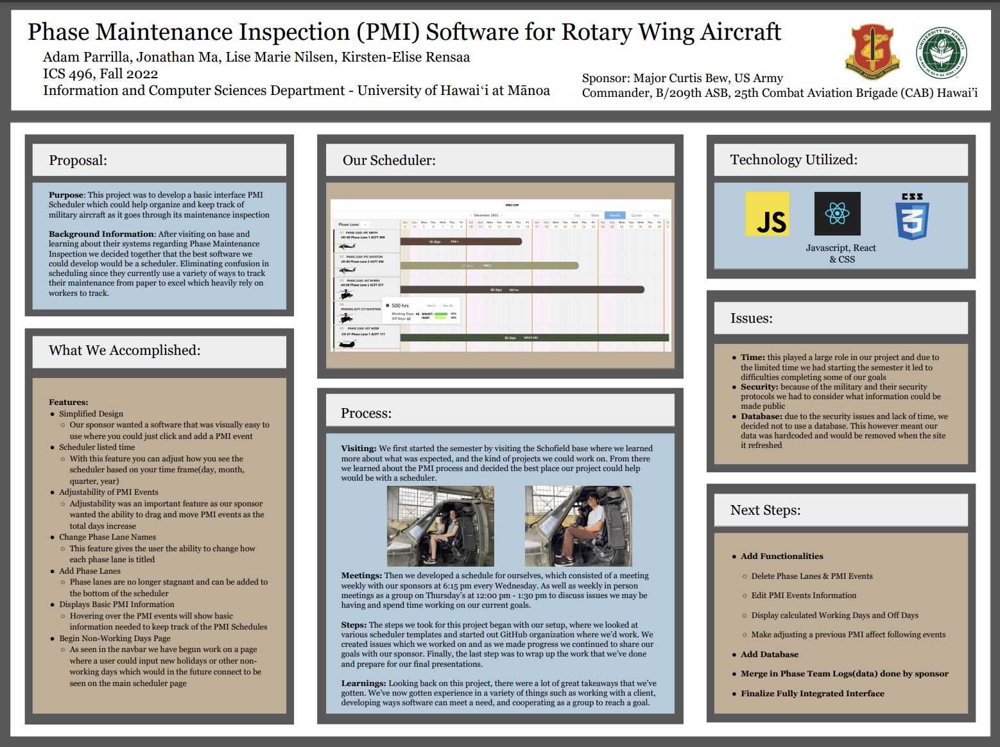

Sponsor: Major Curtis Bew, US Army Commander, B/209th ASB, 25th Combat Aviation Brigade (CAB) Hawaiʻi

## Project Statement

---

For this project, our goal was to develop the basic interface for a Phase Maintenance Inspection Scheduler to organize and manage military rotary wing aircraft as it goes through their maintenance inspection.

## Visiting & Background

---

We began our semester working on this project by visiting Schofield's military base where we learned about their systems concerning PMIs and decided the best software we could develop for them would be a scheduler. This would help to remove confusion in managing lanes because they currently use a variety of ways to track their aircraft from paper to excel, heavily relying on workers.

## Project Overview:

---

Looking back on this capstone project, I was fortunate to have worked with a great group of students, Kirsten-Elise Rensaa, Lise Marie Nilsen, and Jonathan Ma made collaborating easy. Together we developed this product from a basic idea to an interface that could be continued and improved on in the future. The first step we started with after discussing our sponsor's needs and problem-solving how we could meet them was by creating a mockup.

After that, we worked on a variety of features that they wanted available, while also maintaining weekly communication with our sponsor in the form of online meetings. Those features included a simplified design, an adjustable time frame, the flexibility of PMI events, changing phase lane names, adding phase lanes, displaying PMI event information, and beginning a page for non-working days.

## My Contributions

---

My main contributions to this project included work on the basic design, hover display for each event, our project posters & slides, as well as the navbar and footer of the software. This involved working in Javascript and through GitHub to add the features that we thought would best suit our sponsor's needs. Because of our project's scope and general planning, a lot of the work that went into this project had to do with time management, adjusting to our sponsor's comments, and working from the ground up developing this idea.

## Experience

---

Overall I found this project to be interesting and a good experience learning more about working with a client. Before this, I had experience in software development, but working with a team and sponsors made this feel like a real-world experience I'd otherwise not receive. I've been able to learn more about cooperating within a group, designing a project, problem-solving, and time management. Regarding the coding in Javascript, I felt very comfortable developing the software and only wish we could've fleshed out more of the functionalities that we had in mind.

Looking towards the future the next steps of this project would be to add new functionalities such as the ability to delete phase lanes & events and make adjusting a previous PMI event affect the following events just to name a couple. It would also be important to add a military secure database, merge their Phase Team Logs(Data), and finalize their interface to at last have a fully functioning PMI scheduler.

To check out our source code for this scheduler click [here](https://github.com/Phase-Maintenance-Inspection/PMI-Scheduler)
