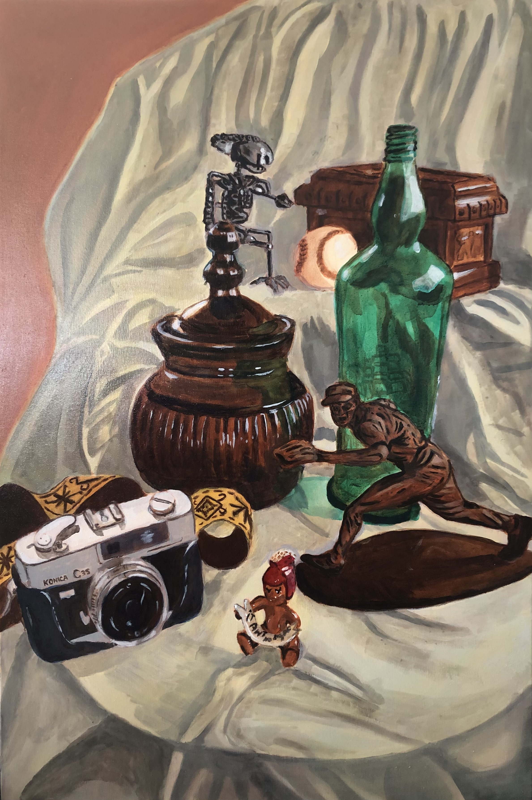
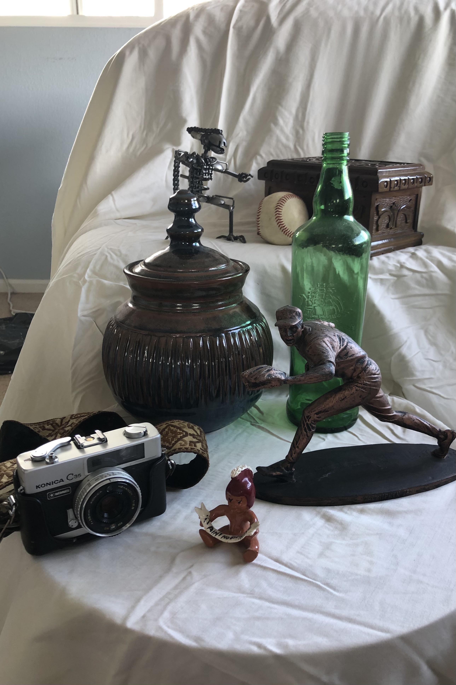
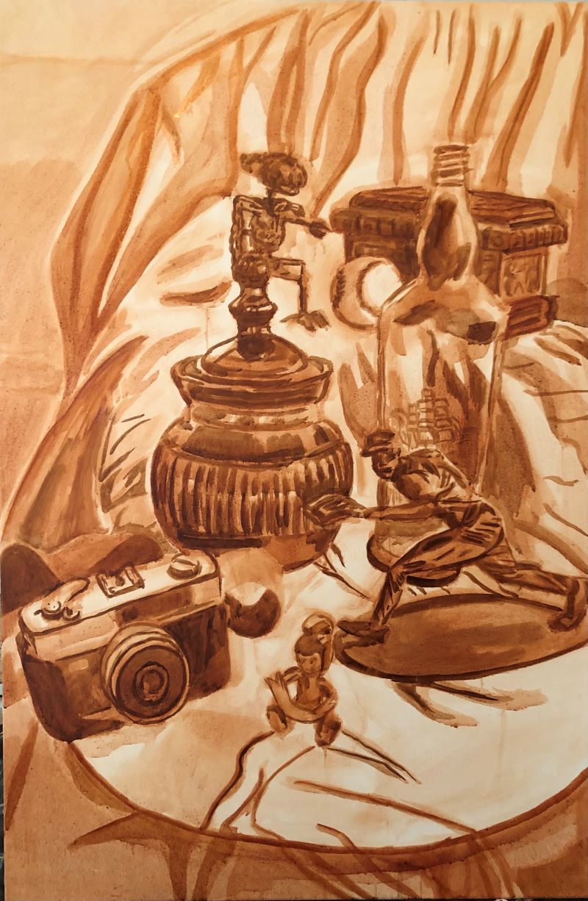
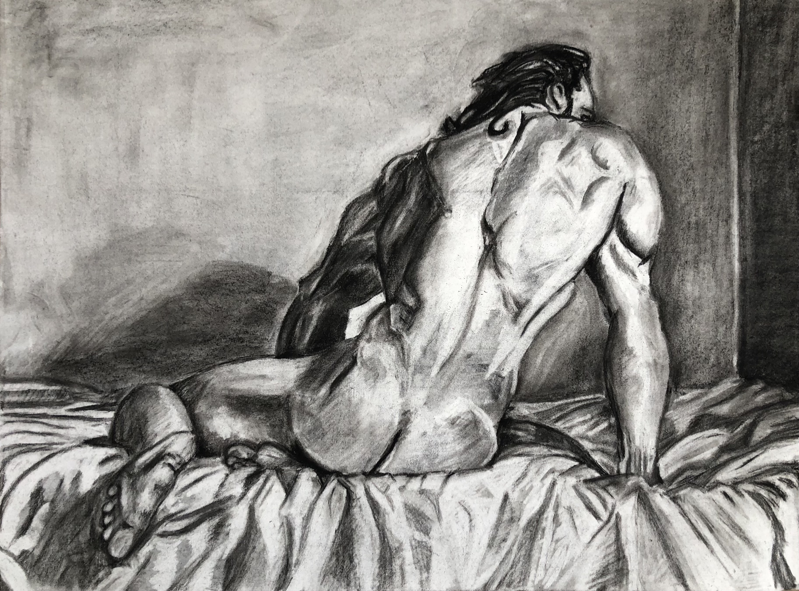
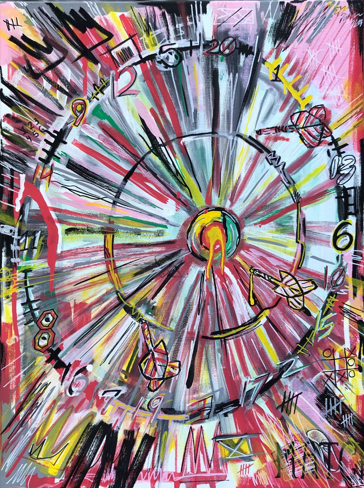
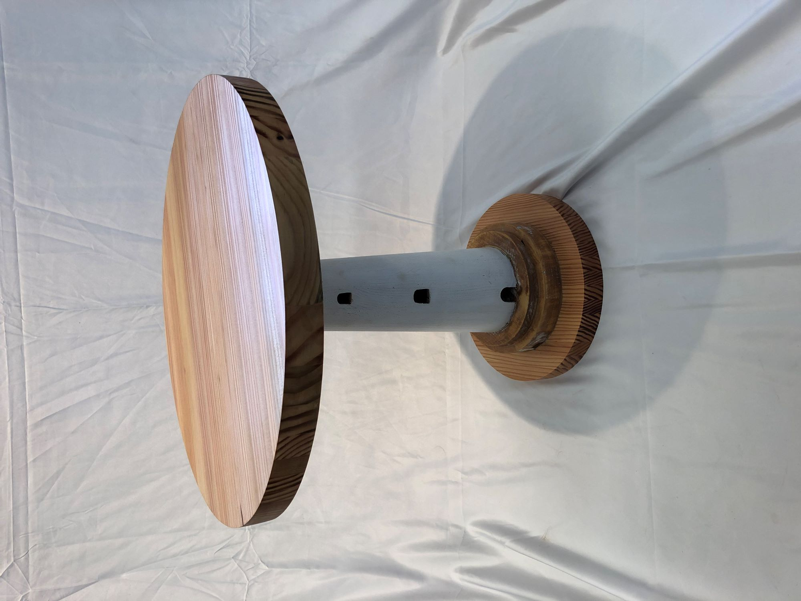

## Description

This painting incorporated originally starting with purely burnt sienna color, which I used the wipe away method to begin to plot in the lighter forms. This gave me a good base to build off, as I incorporated layers of color using Galkyd. Galkyd is an oil painting medium that creates more transparency and an enamel-like surface, making it a great choice for reflective objects such as these. One thing that separates this project from some of the other paintings I have done is the size of this project. Being 24”x36”, this larger scale required me to work in segments and as I slowly worked in details focusing on specific objects to make sure I got them right.

  
  

## Other Projects

Although I’ve been working on various art projects recently, a few of my favorites can be seen below. The first is my final project for ART 214, where we had to incorporate all of the tactics of schematic sketching, tonal changes, and anatomy to develop a fully rendered drawing using charcoal on an 18”x24” paper. Next, is an abstract acrylic painting I made meant to resemble a dartboard. I was inspired by Basquiat an American artist who rose to fame in the 1980s because of his very expressive and abstract work. His work has so much energy in it that I wanted to mirror it in this piece. Finally, during the Spring 2020 semester, I took ART 116 where I learned techniques in woodworking. This table I made originally came from a wooden lighthouse my grandmother had given me. Wanting to repurpose it and make something I could keep forever, I designed this table with the help of the woodworking department at the University of Hawaii at Manoa.

  
  
  

## Experience

Overall, while it may not seem very related, working creatively with various types of mediums has not only been incredibly fun but has also taught me a lot about critical thinking. The same critical thinking and perseverance that goes into any painting or drawing are the same when it comes to web development or game design. Continuing to push yourself, growing in knowledge, working within time crunches, and finding new ways to solve problems are all things that I learn more and more about through art and computer science. So whether it’s learning new techniques in code or art, I think everything is interconnected, and will only better myself as a problem solver and craftsman in everything I do.
