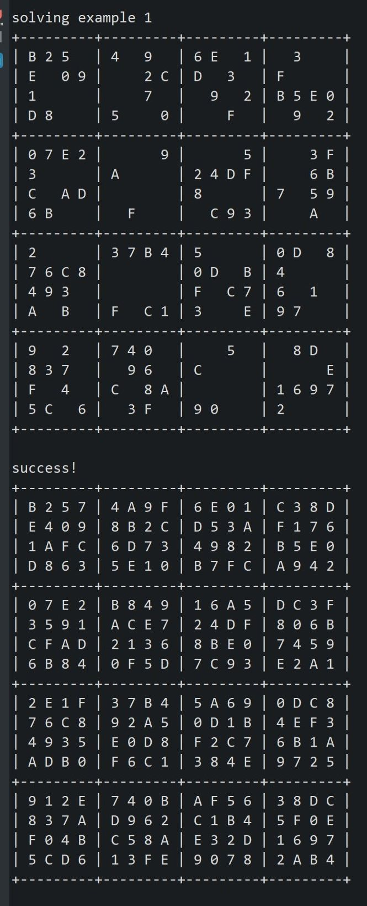
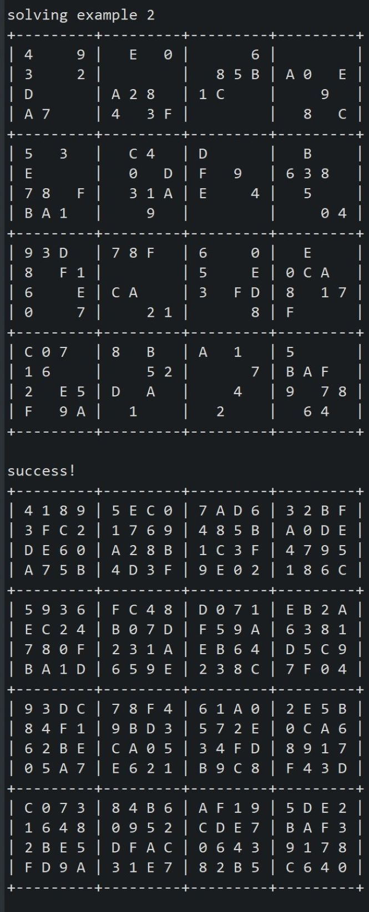

  
  

## Description

---

During my Spring semester of 2020, one homework assignment I had to do for ICS 211 created a Hexadecimal Recursive Sudoku Solver. Implementing recursive backtracking would solve a 16x16 sudoku puzzle. We were helped by our professor Cam Moore, who set up the assignment for us and was tasked with creating solveSudoku and legalValues functions.

## Short Explanation

---

First when looking at the solveSudoku function it checked the puzzle input and empty cells were shown with a -1. The legalValues function then is used by the solveSudoku, creating a list of possible legal values. Then this is repeated as it recursively calls itself until either it is able to solve the sudoku puzzle, or if it encounters a cell with no legal value backtracks to the last cell it encountered and tries the next legal value. Then again it will continue to solve or decide that the puzzle is not solvable.

## Experience

---

This assignment was a great learning experience for me since before this I had barely a clue about recursive topics at all. I was able to understand what recursion is and with the help of my professor and peers learn how recursion can be implemented in scenarios such as this sudoku puzzle. While I know that my recursive skills still have a ways to go, I think that this project was a big step for me moving forward towards getting a strong understanding of more complex coding topics like recursion.

