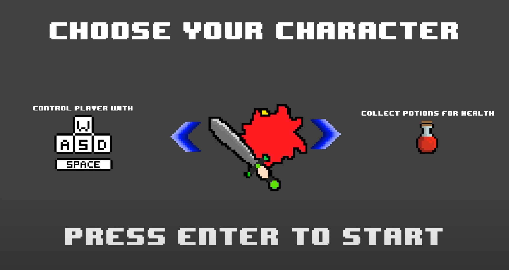
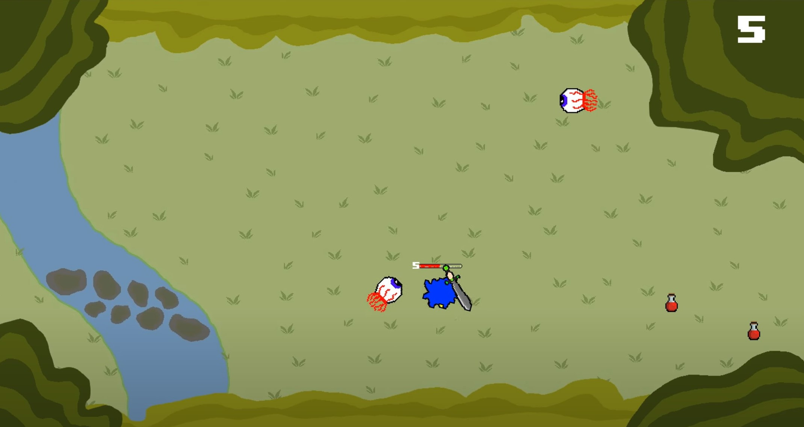
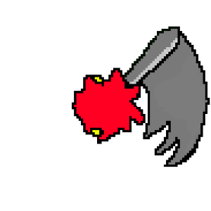
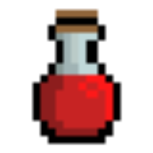
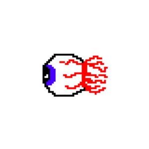

## Description

For my final project in ICS 111, I was able to work alongside Micah Imakyure and Dylan Kaneshiro to produce our own game. This game was a culmination of everything that we had learned, from basic skills and concepts like implementing loops and counters, to things like object-oriented programming. In general, the object of this game is to survive as you’re attacked by enemies. You have a health bar to show how many more hits you can take, as well as a sword to attack and potions appear on the field which heals you.

## My Contributions

I contributed to this project by writing the code for the potions. This allowed players to collect the potion when a character made contact with it on the map. I also designed the characters, enemies, and potions. To do this I worked in MediBang Paint Pro, a free software application to create these 8-bit designs. This was a lot of fun because I was able to merge my interests in artwork and game development, making it feel more like my own.

  
  
  

## Experience

One of the most important things I gained from completing this project is how to work in a group in game development. Collaborating and communicating properly was key for us, and why I also think we were successful in the end. I also gained much more knowledge dealing with basics in Java and coding in general. Although this is still a rough game and needs work, it was an important final project for us to learn how to incorporate basics in programming when trying to develop a fun game!

You can check out a video demonstration of the game here: [Project3VideoAdamParrilla](https://www.youtube.com/watch?v=MCXpzEodSf0).

